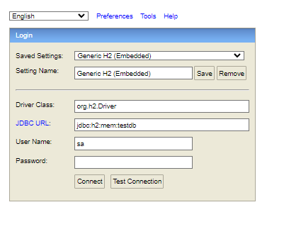
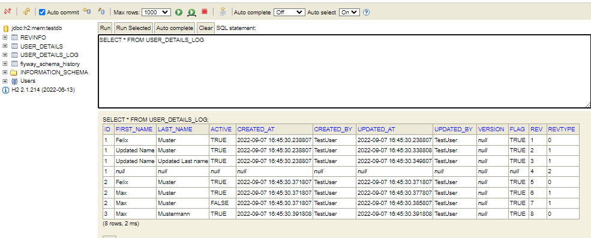
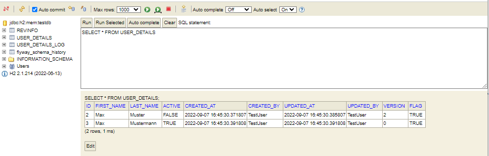

# Spring Boot + Hibernate Envers + Flyway demo

Hibernate Envers provides an easy & flexible way to implement database auditing and versioning. Database Auditing in the context of JPA means tracking and logging the changes on persisted entities. The database audit logs are important from compliance perspectives and also provides grate helps to identify how and what data has been changed.

Hibernate Envers can be integrated very easyly with Spring Boot JPA.

To use Envers in Spring boot application, We need to add below dependency.

```xml
<dependency>
  <groupId>org.springframework.data</groupId>
  <artifactId>spring-data-envers</artifactId>
</dependency>
```

This example is running with or without flyway. You can delete the flyway dependecy from the file _pom.xml_.

To Audit changes that are performed on an entity, we need to add _@Audited_ annotation on the entity.

```java
@Entity
@Getter
@Setter
@Audited
@AuditTable(value="user_details_log")
@Table(name = "user_details")
@AllArgsConstructor
@NoArgsConstructor
@ToString(callSuper=true)
public class UserDetails extends BaseEntity {

    private String firstName;
    private String lastName;

    private Boolean flag;
}
```

In order to log all the changes to entity, Envers needs REVINFO and Entity_log table, In this case it will be USER_DETAILS_LOG.
The REVINFO table contains revision id and revision timestamp. 
A row is inserted into this table on each new revision, that is, on each commit of a transaction, which changes audited data.

Now when we insert,update and delete UserDetails entity, audit log will be saved in USER_DETAILS_LOG table.

```java
private void dataSetup(UserDetailsRepository userRepository) {

    UserDetails userDetails=new UserDetails(1,"Felix","Muster");

    userRepository.save(userDetails);      // Create

    userDetails.setFirstName("Updated Name");
    userDetails=userRepository.save(userDetails); // Update-1

    userDetails.setLastName("Updated Last name"); // Update-2
    userDetails=userRepository.save(userDetails);

    userRepository.delete(userDetails); // Delete

    userDetails=new UserDetails(2,"Felix","Muster");

    userDetails=userRepository.save(userDetails);
    userDetails.setFirstName("Max");// Create
    userDetails=userRepository.save(userDetails);
    userDetails.setActive(false);
    userDetails=userRepository.save(userDetails);

    userDetails=new UserDetails(3,"Max","Mustermann");
    userDetails=userRepository.save(userDetails);

    userRepository.findRevisions(1).stream().forEach(e->{
        Optional<Integer> nr=e.getRevisionNumber();
        UserDetails entity=e.getEntity();
        System.out.println(nr.get()+" "+entity.toString());
    });
}

```

## H2 Console

The console can be accessed by [http://localhost:8080/h2-console](http://localhost:8080/h2-console)

URL: jdbc:h2:mem:testdb



## Table USER_DETAILS_LOG

The table USER_DETAILS_LOG is automatically maintained by spring-boot-envers.  



The REVTYPE column value is taken from the RevisionType Enum. Which has values

- 0-Add
- 1-Update
- 2-Delete

## Table USER_DETAILS

The table USER_DETAILS reflects the current state of USER_DETAILS

